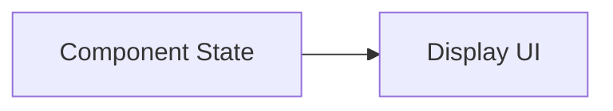
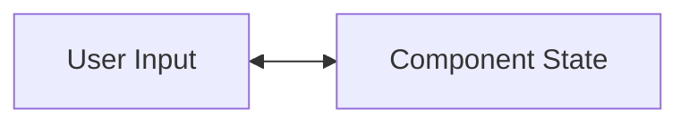
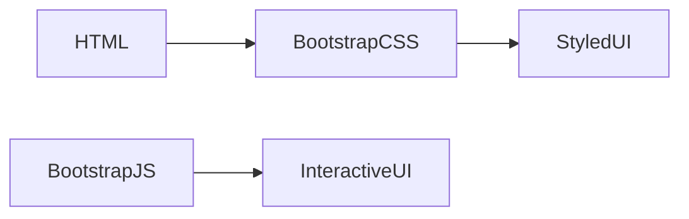

# ASP.NET Core Learning Journey

This repository contains my learning materials, practice exercises, and mini projects developed while studying the ASP.NET Core framework and modern .NET technologies.

The goal of this repository is to document my progress and hands-on experience with building web applications using ASP.NET Core. It includes experiments, sample implementations, and small projects that help me understand the core concepts of backend and full-stack development in the .NET ecosystem.

## What You Will Find in This Repository

- ASP.NET Core fundamentals and project structure
- Web API development using controller-based architecture
- Minimal APIs for lightweight web services
- Integration with Entity Framework Core for database operations
- Blazor components for interactive web UI development
- Client-side integrations using JavaScript and CSS
- Debugging and testing practice projects

## Purpose of This Repository

- Track my learning progress in ASP.NET Core
- Practice real-world development concepts
- Build small projects to strengthen backend and full-stack development skills
- Create a knowledge base for future reference

## Technologies Used

- ASP.NET Core
- .NET
- Blazor
- Entity Framework Core
- C#
- JavaScript
- HTML / CSS


## Demo Projects

### 1. MyFirstAPI (Controller-Based API)

**MyFirstAPP** is a simple ASP.NET Core Web API project built using the **controller-based architecture**.  
It demonstrates how traditional Web APIs are structured using controllers, routes, and action methods.

**Features**

- Controller-based API structure
- Basic API endpoints for testing
- RESTful API design principles
- Example request/response handling

**Example Endpoints**
- GET /api/product
- POST /api/product
- PUT /api/product/{id}
- DELETE /api/product/{id}

**How to Run**

1. Navigate to the project folder

 ``` bash
 cd MyFirstAPP
  ```

2. Run the project

``` bash
dotnet run
```

3. Open the browser or API testing tool (Postman)


http://localhost:<port>/api/products


### 2. MinimalApiDemo (Minimal API Architecture)

**MinimalApiDemo** demonstrates the **Minimal API architecture** in ASP.NET Core.  
Instead of controllers, all endpoints are defined directly in `Program.cs`, making the application lightweight and easy to understand.

This project also integrates **Swagger** for API documentation and testing.

**Features**

- Minimal API endpoint definitions
- CRUD endpoints for sample product data
- Swagger UI integration for API testing
- Clean and lightweight API design

**Example Endpoints**


- GET /api/products
- POST /api/products
- PUT /api/products/{id}
- DELETE /api/products/{id}


#### Swagger Integration

Swagger is used to automatically generate API documentation and provide an interactive interface for testing endpoints.

##### Required Configuration

In `Program.cs`:

### Swagger Configuration in Program.cs

 ``` csharp 
builder.Services.AddEndpointsApiExplorer();
builder.Services.AddSwaggerGen();

// Enable Swagger middleware
if (app.Environment.IsDevelopment())
{
    app.UseSwagger();
    app.UseSwaggerUI();
}
```
#### How to Run MinimalApiDemo

1. Navigate to the project folder

``` bash
cd MinimalApiDemo
```

2. Add Swagger integration

``` bash
dotnet add package Swashbuckle.AspNetCore
```

3. Run the application

``` bash
dotnet run
```

4. Open Swagger UI in the browser

http://localhost:<port>/swagger

You can use the Swagger interface to test all API endpoints directly from the browser.

### 3. MVCBlazorTest (MVC architecture with Blasor Framework)

MVCBlazorTest is a web application built using **ASP.NET Core MVC architecture integrated with Blazor Server**. This project demonstrates how traditional MVC applications can be enhanced with **interactive Blazor components**, enabling dynamic UI behavior using C# instead of JavaScript.


**Features**

- MVC-based page structure  
- Reusable Blazor components  
- Server-side interactivity using C#  
- Clean separation of concerns  
- Integration of Razor Views with Blazor components  


**Technologies Used**

- ASP.NET Core MVC  
- Blazor Server  
- C#  
- Razor Views  
- SignalR

#### Required Configuration

In `Program.cs`:

##### Swagger Configuration in Program.cs

 ``` csharp 
var builder = WebApplication.CreateBuilder(args);

// Add services to the container.
builder.Services.AddControllersWithViews();

//Add Blazer services to the container.
builder.Services.AddServerSideBlazor()
    .AddCircuitOptions(o => o.DetailedErrors = true);

var app = builder.Build();

// Configure the HTTP request pipeline.
if (!app.Environment.IsDevelopment())
{
    app.UseExceptionHandler("/Home/Error");
    // The default HSTS value is 30 days. You may want to change this for production scenarios, see https://aka.ms/aspnetcore-hsts.
    app.UseHsts();
}

app.UseHttpsRedirection();
app.UseStaticFiles();
app.UseRouting();

app.UseAuthorization();


app.MapControllerRoute(
    name: "default",
    pattern: "{controller=Home}/{action=Index}/{id?}");

    app.MapBlazorHub(); // For Blazor Intigration


app.Run();
```

#### How to Run MvcBlazorTest

1. Navigate to the project folder

``` bash
cd MvcBlazorTest
```

2. Intigrate Blazor Framwork

``` bash
dotnet add package Microsoft.AspNetCore.Components.Web
```

3. Run the application

``` bash
dotnet run
```

### 4. ReactIntegration (React + Vite Frontend with ASP.NET Core Backend)

**ReactIntegration** is a full-stack project that integrates a **React frontend built with Vite** and an **ASP.NET Core backend API**. This setup demonstrates how modern frontend tooling can communicate with a robust .NET backend for dynamic data rendering.

**Features**

- Frontend built using **React + Vite** for fast development and hot module replacement  
- Backend using **ASP.NET Core Web API** for handling requests  
- Fetching and displaying **WeatherForecast** data from `/weatherforecast` API endpoint  
- Client-side rendering with React components consuming server API  
- Real-time updates in the UI without page reload  

**Technologies Used**

- ASP.NET Core  
- React + Vite  
- JavaScript / JSX  
- Fetch API for HTTP requests  
- CSS for styling  

#### Required Configuration

1. Ensure ASP.NET Core backend is running on a port (e.g., `http://localhost:5129`)  
2. Configure React frontend to proxy API requests in `vite.config.js`:

```javascript
import { defineConfig } from 'vite'
import react from '@vitejs/plugin-react'

// https://vite.dev/config/
export default defineConfig({
  plugins: [react()],
  server: {
    proxy: {
      '/weatherforecast': ' http://localhost:5129'
    }
  }
})
```
#### How to Run ReactIntegration

1. Frontend

``` bash
cd ReactIntegration/react-dashboard
npm install
npm run dev
```

2. Backend

``` bash
cd ReactIntegration/ReactDashboardAPI
dotnet run
```


## Data Binding in Blazor

Data binding in Blazor connects the **UI with application logic**, allowing data to automatically update between them without manual refresh.

---

### 🔹 Types of Data Binding

#### 1. One-Way Binding
Data flows from the code to the UI (read-only display).

```razor
<p>Hello, @name</p>

@code {
    string name = "Nimesh";
}
```
Mermaid chart

    
#### 2. Two-Way Binding
Data flows both ways using @bind. Changes in UI update the variable automatically.

```razor
<input @bind="name" placeholder="Enter name" />

<p>Hello, @name</p>

@code {
    string name = "";
}
```
Mermaid chart


### 🔹 Real-Time Input Example

```razor
<input @bind="search" @bind:event="oninput" />

<p>You typed: @search</p>

@code {
    string search = "";
}
```
### 🔹 Use Cases

- Form handling (user input updates instantly)
- Dynamic UI updates without page reload
- Maintaining state across components

## Bootstrap Integration in ASP.NET Core

Bootstrap integration in ASP.NET Core enables developers to build responsive, mobile-first UI quickly using pre-built CSS and JavaScript components.

---

### 🔹 Why Use Bootstrap

- Faster UI development
- Built-in responsive grid system
- Pre-designed components (buttons, cards, navbar, forms)
- Consistent design across pages

### 🔹 Adding Bootstrap to `_Layout.cshtml`

```javascript
<!DOCTYPE html>
<html lang="en">
<head>
    <meta charset="utf-8" />
    <meta name="viewport" content="width=device-width, initial-scale=1.0" />
    <title>@ViewData["Title"] - MyApp</title>

    <!-- Bootstrap CSS -->
    <link href="https://cdn.jsdelivr.net/npm/bootstrap@5.3.2/dist/css/bootstrap.min.css" rel="stylesheet" />

    <!-- Site CSS -->
    <link rel="stylesheet" href="~/css/site.css" asp-append-version="true" />
</head>
<body>

    <!-- Navbar -->
    <header>
        <nav class="navbar navbar-expand-lg navbar-dark bg-dark">
            <div class="container">
                <a class="navbar-brand" asp-controller="Home" asp-action="Index">MyApp</a>

                <button class="navbar-toggler" type="button" data-bs-toggle="collapse" data-bs-target="#navbarContent">
                    <span class="navbar-toggler-icon"></span>
                </button>

                <div class="collapse navbar-collapse" id="navbarContent">
                    <ul class="navbar-nav me-auto mb-2 mb-lg-0">
                        <li class="nav-item">
                            <a class="nav-link" asp-controller="Home" asp-action="Index">Home</a>
                        </li>
                        <li class="nav-item">
                            <a class="nav-link" asp-controller="Home" asp-action="Privacy">Privacy</a>
                        </li>
                    </ul>
                </div>
            </div>
        </nav>
    </header>

    <!-- Main Content -->
    <div class="container mt-4">
        @RenderBody()
    </div>

    <!-- Footer -->
    <footer class="bg-light text-center text-muted mt-5 p-3">
        <div class="container">
            <p>&copy; @DateTime.Now.Year - MyApp | Built with ASP.NET Core & Bootstrap</p>
        </div>
    </footer>

    <!-- Bootstrap JS Bundle -->
    <script src="https://cdn.jsdelivr.net/npm/bootstrap@5.3.2/dist/js/bootstrap.bundle.min.js"></script>

    <!-- Site JS -->
    <script src="~/js/site.js" asp-append-version="true"></script>

    @RenderSection("Scripts", required: false)

</body>
</html>
```
### 🔹 Key Idea

Bootstrap works by combining layout and components:




## Author

Nimesh Dhananjaya  
Software Engineer | Bachelor of Computer Science – University of Ruhuna
